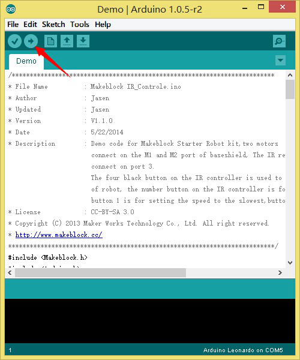
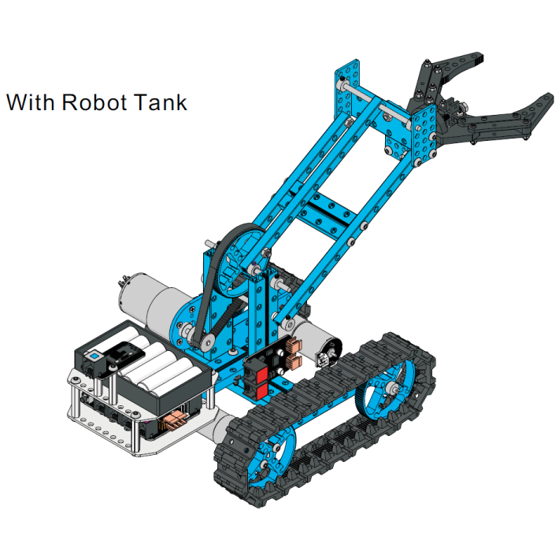

[ Library v2.1.0625](https://www.makeblock.cc)

The package consists of the demo program and structure assembly instruction.

###Brief Procedure

1. Download and install Arduino-1.0.5，http://arduino.cc/en/Main/Software

2. Download the package and decompress it.

3. Connect Me baseboard to computer with micro USB cable.

4. Open demo.ino by Arduino IDE. Click Tools->Serial Ports, choose COM XX (Not COM1 and COM2). Click Tools->Boards, choose Arduino Leonardo. At last, click "upload" button on the right-top corner.
                                                                                  
5. Now, you could control the robot arm by IR. Press A&D to lift up or lift down the arm, press E&C to open or close the gripper.

